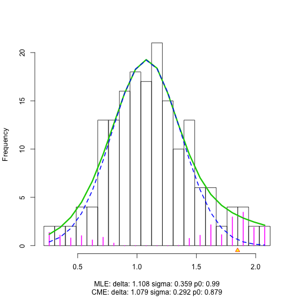

<!-- README.md is generated from README.Rmd. Please edit that file -->


# n1pas

blah

## Overview


## Installation


```r
## Install from github directly using the R package 'devtools'
# install.packages("devtools")
devtools::install_github("tidyverse/ggplot2", ref = "develop")
```

## Usage


```r
library(n1pas)
## Retrieve the library location to access files needed for this tutorial
my_path <- find.package("n1pas")
## Run and store Nof1-pathways Mahalanobis distance for the 4 pairs of data.
annot_file <- file.path(my_path, "extdata/kegg_tb.txt")
## annot_file <- file.path(my_path, "inst/extdata/kegg_tb.txt")
desc_file <- file.path(my_path, "extdata/kegg.description_tb.txt")
## desc_file <- file.path(my_path, "inst/extdata/kegg.description_tb.txt")

iso_data <- blca_patient_iso_kegg

enrichment_profile <- compute_n1pas(iso_data = iso_data, annot_file = annot_file, desc_file = desc_file, iso_range = c(2,30), genes_range = c(15,500), small_ontology = TRUE, plot_locfdr = 1)
```



```r

## Explore the top five dysregulated pathways for the first patient.
head(enrichment_profile, 15)
#>          pathway_score  fdr_value num_genes_annot num_genes_measured
#> hsa00670      4.566867 0.00000000              18                 15
#> hsa05211      2.354654 0.00000000              70                 46
#> hsa04540      2.164417 0.00000000              90                 58
#> hsa05213      2.121612 0.02662560              52                 39
#> hsa05218      2.072953 0.02794445              71                 47
#> hsa03020      2.022463 0.04838938              29                 20
#> hsa04115      1.961458 0.08247495              68                 46
#> hsa03440      1.928977 0.10835410              28                 18
#> hsa03022      1.866148 0.17434023              37                 21
#> hsa05110      1.856213 0.18781769              54                 29
#> hsa05219      1.856213 0.18781769              42                 29
#> hsa05221      1.826214 0.22851314              57                 40
#> hsa04962      1.820241 0.23661523              44                 24
#> hsa03040      1.778470 0.30825666             127                 68
#> hsa04530      1.761299 0.34170396             132                 85
#>          upper_fdr_threshold diff_splice_call
#> hsa00670            1.847233                1
#> hsa05211            1.847233                1
#> hsa04540            1.847233                1
#> hsa05213            1.847233                1
#> hsa05218            1.847233                1
#> hsa03020            1.847233                1
#> hsa04115            1.847233                1
#> hsa03440            1.847233                1
#> hsa03022            1.847233                1
#> hsa05110            1.847233                1
#> hsa05219            1.847233                1
#> hsa05221            1.847233                0
#> hsa04962            1.847233                0
#> hsa03040            1.847233                0
#> hsa04530            1.847233                0
#>                                      pathway_desc
#> hsa00670                One carbon pool by folate
#> hsa05211                     Renal cell carcinoma
#> hsa04540                             Gap junction
#> hsa05213                       Endometrial cancer
#> hsa05218                                 Melanoma
#> hsa03020                           RNA polymerase
#> hsa04115                    p53 signaling pathway
#> hsa03440                 Homologous recombination
#> hsa03022              Basal transcription factors
#> hsa05110                Vibrio cholerae infection
#> hsa05219                           Bladder cancer
#> hsa05221                   Acute myeloid leukemia
#> hsa04962 Vasopressin-regulated water reabsorption
#> hsa03040                              Spliceosome
#> hsa04530                           Tight junction
## Store the top five pathways ID ("path_id") to compare to other patients.
```

## Getting help

There are two main places to get help with n1pas:

1.  [Stack Overflow][so] is a great source of answers to common ggplot2
    questions. It is also a great place to get help, once you have
    created a reproducible example that illustrates your problem.
	
2.  Need help? Email the listserv mailing list nof1pathwayssupport@list.arizona.edu.
