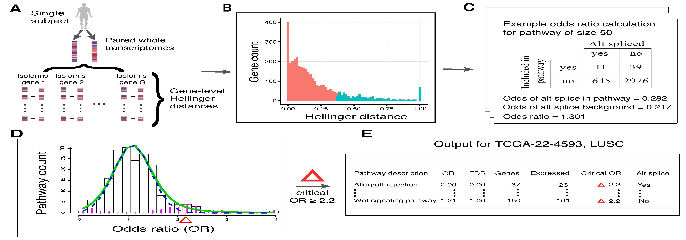

# Introductory remarks

Welcome to the <span style="color:purple">N-of-1-*pathways*</span> analysis tutorial! The intent of this document is to familiarize users with the basic functions included in the `nof1` `R` package through a demonstration of a typical analytic workflow.

## Brief overview of <span style="color:purple">N-of-1-*pathways*</span>

The software transforms a pair of transcriptomes from a single subject to a personal profile of pathway dysregulation^[Gardeux, V. et al. N-of-1-pathways unveils personal deregulated mechanisms from a single pair of RNA-Seq samples: towards precision medicine. J. Am. Med. Inform. Assoc. 21, 1015–25 (2014).]. The algorithm quantifies dysregulation^[Schissler, A. G. et al. Dynamic changes of RNA-sequencing expression for precision medicine: N-of-1-pathways Mahalanobis distance within pathways of single subjects predicts breast cancer survival. Bioinformatics 31, i293–i302 (2015).] (**effect size**) within a gene set along with statistical significance (**p-value**) in high throughput. Lastly, personal dysregulation profiles are visualized for pattern recognition through novel 'omic **rose plots**^[Schissler, A. Grant, et al. "Analysis of aggregated cell–cell statistical distances within pathways unveils therapeutic-resistance mechanisms in circulating tumor cells." Bioinformatics 32.12 (2016): i80-i89.]. Moreover, these paired calculations can be applied in related problems, such as single-cell RNA-seq^3. Please refer to the references provided in the footnotes for details on these methods. The schematic below illustrates the <span style="color:purple">N-of-1-*pathways*</span> workflow:

```{r workflow_png, echo = F, out.width = 700, fig.retina = NULL}

```

## Scope of the tutorial

In this demonstration, we will apply <span style="color:purple">N-of-1-*pathways*</span> to study the transcriptomes from four breast cancer patients. As we are applying the framework to multiple patients in one workflow, the majority of `nof1` function used will have a `multi` designation. For example, the function `compute_multi_nof1_pathways` will be employed vs. `compute_nof1_pathways`. A truly one subject analysis is rare in practice, but rest assured that the analogous functions behave in a similar manner. Moreover, `compute_nof1_pathways` (and other non-`multi` functions) allow for more advanced users to flexibly calculate in non-standard scenarios.

***

# Analysis of TCGA breast cancer patients

## Step 0: Installing and attaching the package

As the `nof1` package is not available on a public repository, the package must first be downloaded to a local destination. Then install using the following command (after updating with the system-specific path and version):

`devtools::install_github("grizant/n1pas")`

Be sure to employ the usual `library()` call in any data analysis scripts after installation.

```{r lib}
## Load and attach the nof1 package after installation.
library(n1pas)
## Retrieve the library location to access files needed for this tutorial
my_path <- find.package("n1pas")
```

## Step 1: Read gene expression data and define sample pairings

Utility functions are available to read/write gene expression, gene set (pathway) definitions, gene set descriptions, and sample data pairing specifications.

### 1.1: Reading in the gene expression

The first step is to read gene expression data into the workspace. In this tutorial, we will employ matched normal/tumor pairs of RNA-seq data from TCGA^[Chang K, et al. The Cancer Genome Atlas Pan-Cancer analysis project. Nature Genetics. 2013 Sep 26; 45(10):1113–20. doi: 10.1038/ng. 2764 PMID: 24071849] breast cancer patients as example data. We have preprocessed four matched pairs (8 transcriptomes) into an R data file to maintain a reasonable package size. Samples are labeled as `TCGA.XX.XXXX.N` or `TCGA.XX.XXXX.T`, where `XX.XXXX` identifies the patient and `N` or `T` indicates normal or tumor, respectively.

Notably, gene expression data can also be read into R using utilities provided by the package. The format for an input text file is specified in the `read_gene_set` function documentation. In short, the rows are the genes and the columns are the samples in a tab-delimited file. 

```{r read_gene_expr}
## Example syntax for a text file:
## my_data <- read_gene_data("/path/to/file/gene_expr.txt")
## Load compressed gene expression data for the tutorial 
data(blca_patient_iso_kegg)
## Display a few genes for the first two pairs of transcriptomes.
head(blca_patient_iso_kegg)
## notice that the rows are labeled by isoform ID
```

## Step 2: Define pathways via a knowledgebase

In gene set (i.e, pathway) analysis genes are annotated into functional groups through a variety of approaches. In the `nof1` package, we include pathways defined by the Pathway Interaction Database (PID)^[Schaefer, Carl F., et al. "PID: the pathway interaction database." Nucleic acids research 37.suppl 1 (2009): D674-D679.]. These are signaling pathways that are often indicated in cancer. The choice of ontology (knowledgebase) is an important consideration and will vary depending on the context and research objectives. However, that discussion is outside the scope of this tutorial. 

From a practical standpoint, the format required is a 'long' structure. A tab-delimited text file is expected with pathway ID as the first variable and the HUGO gene symbol as the second.

```{r read_gene_set}
## An example of how to read in a pathway definitions.
## kegg_annot <- read_gene_set(file.path(my_path,"inst/extdata/PID_filtered15-X.txt"))
head(kegg_annot)
```

It is often useful to include pathway descriptions in the output of the <span style="color:purple">N-of-1-*pathways*</span> framework. The format is very similar to above, but with the second variable indicated the pathway description - not pathway membership.

```{r read_gene_desc}
## note that read_gene_set reads both gene set definitions and descriptions
## pid_desc <- read_gene_set(file.path( my_path, "inst/extdata/PID_description.txt"))
head(kegg_desc)
```

## Step 3: Compute pathway dysregulation profiles

Now that the gene expression data and pathway annotation steps are complete, the actual calculation of pathway differential expression and statistical significance can be performed. Again, the details of the methods are provided in the references below and outside of the scope of this document.

In the example below, <span style="color:purple">N-of-1-*pathways*</span> Mahalanobis distance is applied to the four breast cancer patients in one convenient function call. The result is a list of data frames containing pathway scores for each of the 187 PID signaling pathways. 

Often, a clinician or researcher *a priori* selects pathways of interest to study for treatment decisions or hypothesis testing. Here we arbitrary select the top five dysregulated pathways from the first patient to compare to the other three patients. In this context, the effect size and p-value for each pathway represent dysregulation as tumor tissue is compared to similar, non-tumor tissue from the same patient.

```{r pathway_scores}
## Run and store Nof1-pathways Mahalanobis distance for the 4 pairs of data.
pathway_scores <- compute_multi_nof1_pathways(gene_data, sample_data = sample_data,
                                              gene_set = pid_filtered,
                                              model = "md", gene_set_desc = pid_desc)
## Explore the top five dysregulated pathways for the first patient.
pathway_scores[[1]][1:5,]
## Store the top five pathways ID ("path_id") to compare to other patients.
top_ids <- row.names(pathway_scores[[1]])[1:5]
```
Note for larger data sets and ontologies, memory issues/speed could preclude the computation. In that case, it is advised to break up the analysis into smaller pieces and/or use the parallelization parameter in the function call. Also, the use of high-performance computing clusters is applicable.

## Step 4: Visualize top pathway scores across patients

Finally, the `nof1` package includes novel visualization tools to study and compare pathway dysregulation profiles. One such plot a rose plot. 

```{r rose_plot, fig.width = 15, out.width = 700, fig.height = 10}
## Shorten the pair names for display.
names(pathway_scores) <- gsub("TCGA\\.", "", names(pathway_scores))
## Create multiple rose plots, paneled by patient.
create_multi_rose_plot(pathway_scores, which_pathways = top_ids)
```

Here the negative natural logarithm of the p-values corresponding the each of the top five dysregulated pathways for patient A7.A0DB determine the radii for the 'petals'. The petal areas are properly scaled so that the areas are proportional to the statistical significance of dysregulation. Note that there are a total of five petals for each rose plot. Petals above the horizontal axis (in blue) represent pathways that are higher expressed in the tumor tissue and conversely for the pathways that are down-regulated (in brown).

Note striking heterogeneity for these four patients. Patient E2.A153 has all five pathways that are significantly down-regulated. Whereas, both BH.A1EU and AC.A2FM are only significantly up-regulated in ATR signaling and Fanconi anemia in these five pathways. Comparisons of patient characteristics and/or determination of treatment plans could lead to better patient outcomes using these visualizations.

# Concluding remarks

That concludes this tutorial to the `nof1` package to implement the <span style="color:purple">N-of-1-*pathways*</span> framework. The package is in heavy development with more features, methods, and tutorials forthcoming. Please refer to the package documentation for detailed explanations and examples on all the functions and data sets. 

Also, we greatly appreciate your support by citing the <span style="color:purple">N-of-1-*pathways*</span> framework:

```{citation}
citation("nof1")
```

Please also cite any particular method within the framework such as the Mahlanobis distance.

Thanks for reading!

